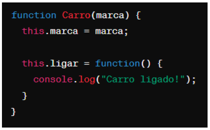

# Instruções

- Faça uma cópia deste arquivo .md para um repositório próprio
- Resolva as 6 questões objetivas assinalando a alternativa correta
- Resolva as 4 questões dissertativas escrevendo no próprio arquivo .md
  - lembre-se de utilizar as estruturas de código como ``esta aqui com ` `` ou
```javascript
//esta aqui com ```
let a = "olá"
let b = 10
print(a)
```
- Resolva as questões com uso do Visual Studio Code ou ambiente similar.
- Teste seus códigos antes de trazer a resposta para cá.
- Cuidado com ChatGPT e afins: entregar algo só para ganhar nota não faz você aprender e ficar mais inteligente. Não seja dependente da máquina!
- ao final, publique seu arquivo lista_01.md com as respostas em seu repositório, e envie o link pela Adalove. 

# Questões objetivas

**1)** O que o código a seguir faz?


Escolha a opção que responde corretamente:

a) ~~Imprime os números pares de 1 a 10.~~ - Alternativa Escolhida

b) Imprime os números ímpares de 1 a 10.

c) Imprime os números pares de 2 a 10.

d) Imprime os números ímpares de 2 a 10.

______

**2)** Identificar a linha que falta no código para criar uma classe Veiculo com atributo marca, e uma classe Carro que herda de Veiculo com um método ligar(). 


No lugar onde está escrito “// linha” qual das opções abaixo deve estar para funcionar corretamente o código?

A) ~~let carro = new Carro("Toyota");~~ - Alternativa Escolhida

B) let ligar = new ligar("Toyota");

C) class Moto extends Veiculo {};

D) carro1.ligar();

______

**3)** Qual é o valor de resultado após a execução deste código?


Escolha a opção que responde corretamente:

A) ~~18~~ - Alternativa Escolhida

B) 16

C) 14

D) 12

______

**4)** Como você criaria um método `acelerar()` em uma classe `Carro`, que recebe um parâmetro `velocidade` e o adiciona a um atributo `velocidadeAtual`?

A)  - Alternativa Escolhida

B) 

C) 

D) 

______

**5)** Qual a forma correta de definir uma classe Carro em JavaScript, com um método ligar() e um atributo marca?

A) ~~~~ - Alternativa Escolhida

B) 

C) 

D) 

______

**6)** Observe o código abaixo:


Qual será a saída do código acima?

A) ~~"Olá, meu nome é João. Olá, meu nome é Maria."~~ - Alternativa Escolhida

B) "Olá, meu nome é ."

C) "João Maria"

D) "undefined undefined"

______

# Questões dissertativas

**7)** Vamos criar um programa em JavaScript para entender classes, métodos e atributos!
Classe Animal:
- Crie uma classe chamada Animal.
- Adicione dois atributos: nome e idade.
- Adicione um método chamado descrever() na classe Animal.
  - Este método deve exibir no console uma descrição do animal com seu nome e idade.

Criando e manipulando Animais:
- Crie dois objetos da classe Animal: um chamado "cachorro" e outro "gato", com idades distintas.
- Para cada animal, chame o método descrever() para ver a descrição no console.

Dica: Utilize `console.log()` para exibir as informações!

SOLUÇÃO:
````js
class Animal {
    constructor(nome, idade){
        //CONSTRUTOR DO OBJETO COM O NOME E IDADE
        this.nome = nome;
        this.idade = idade;
    }
    descrever(){
        return `Olá, meu nome é ${this.nome}, tenho ${this.idade} ano(s)` //RETORNA O NOME E IDADE COM BASE NO INPUT DO OBJETO, COM OS DADOS PEGO NO CONSTRUTOR
    }
}
const gato = new Animal("Gabriel", 18) //CRIA UM NOVO OBJETO GATO DA CLASSE ANIMAL COM O NOME GABRIEL E IDADE 18 (REFERÊNCIA)
const cachorro = new Animal("OutroQualquer", 4) //CRIA UM OUTRO OBJETO TAMBÉM DA CLASSE ANIMAL
console.log(gato.descrever())
console.log(cachorro.descrever()) //CHAMA A FUNÇÃO DESCREVER QUE RETORNA UMA STRING QUE É EXIBIDA NO CONSOLE
````

______

**8)** Nos últimos dias tivemos a oportunidade de ter contato com Programação Orientada a Objetos, e tivemos contato com o tema "herança". Herança é um princípio de orientação a objetos, que permite que classes compartilhem atributos e métodos. Ela é usada na intenção de reaproveitar código ou comportamento generalizado ou especializar operações ou atributos. Então vamos praticar esse conteúdo nessa questão.
Vamos criar um programa em JavaScript para entender classes, métodos, atributos e herança!

Classe Animal:
- Crie uma classe chamada Animal.
- Adicione dois atributos: nome e idade.
- Adicione um método descrever() que exiba no console uma descrição do animal com seu nome e idade.

Classe Gato (Herda de Animal):
- Crie uma classe chamada Gato que herda da classe Animal.
- Adicione um atributo extra cor específico para gatos.
- Adicione um método miar() que exiba no console o som que um gato faz.

Criando Animais:
- Crie dois objetos da classe Animal: um chamado cachorro e outro gato, com idades distintas.
- Para o gato, também defina a cor.

Chamando os Métodos:
- Para cada animal, chame o método descrever() para ver a descrição no console.
- Para o gato, chame o método miar() para "ouvir" o som que ele faz (é também para ver o som no console).

Dica: Utilize console.log() para exibir as informações!

SOLUÇÃO: 
````js
class Animal {
    constructor(nome, idade){
        //CONSTRUTOR DO OBJETO COM O NOME E IDADE
        this.nome = nome;
        this.idade = idade;
    }
    descrever(){
        return `Olá, meu nome é ${this.nome}, tenho ${this.idade} ano(s)` //RETORNA O NOME E IDADE COM BASE NO INPUT DO OBJETO, COM OS DADOS PEGO NO CONSTRUTOR
    }
}
class Gato extends Animal {
    constructor(nome, idade, cor){
        //COLOCA UM NOVO CONSTRUTOR PARA O GATO, PEGANDO A COR E USANDO TAMBÉM O CONSTRUTOR DA CLASSE ANTIGA, PARA TER O NOME E IDADE
        super(nome, idade)
        this.cor = cor
    }
    descrever(){
        //RETORNA A DESCRIÇÃO DO GATO COM O NOME, IDADE E COR - SOBRESCREVE O MÉTODO DESCREVER DA CLASSE ANIMAL
        return `Olá, meu nome é ${this.nome}, tenho ${this.idade} ano(s) e minha cor é ${this.cor}`
    }
    miar(){
        //MÉTODO QUE RETORNA O MIADO DO GATO
        return `MIAUUUUUUUUUUUUUUUUUUUU!`
    }
}
const cachorro2 = new Animal("OutroQualquer", 7) //CRIA O OBJETO CACHORRO DA CLASSE ANIMAL
const gato2 = new Gato("Gabriel", 10, "Cinza Escuro") //CRIA O OBJETO GATO2 DA CLASSE GATO QUE ESTENDE A CLASSE ANIMAL
console.log(gato2.descrever())
console.log(gato2.miar())
console.log(cachorro2.descrever())
//CHAMA OS MÉTODOS DESCREVER E DE MIAR DOS OBJETOS
````

______

**9)** Vamos criar um programa em JavaScript para somar notas!

Classe SomadorDeNotas:
- Crie uma classe chamada SomadorDeNotas.
- Adicione um atributo total inicializado com 0 para armazenar a soma das notas.

Método adicionarNota:
- Adicione um método chamado adicionarNota(nota) na classe SomadorDeNotas.
- Este método deve receber um parâmetro nota e somá-lo ao atributo total.

Criando o Somador e Adicionando Notas:
- Crie um objeto da classe SomadorDeNotas, chamado somador.
- Utilize o método adicionarNota(nota) para adicionar algumas notas ao somador.

Chamando o Método para Ver o Total:
- Após adicionar todas as notas, chame um método verTotal() para exibir o total das notas adicionadas.

Dica: Utilize console.log() para exibir as informações!

SOLUÇÃO:
````js
class SomadorDeNotas {
    //CRIA A CLASSE SOMADOR DE NOTAS
    constructor(){
        //NO CONTADOR COLOCA DOIS PARAMETROS PARA CRIAR O OBJETO
        this.total = 0
        this.contador = 0
    }
    adicionarNota(nota){
        //RECEBE UMA NOTA COMO PARAMETRO E SOMA ELA NO VALOR ATUAL DE TOTAL, ALÉM DISSO ADICIONA UM NO CONTADOR PARA CALCCULAR A MÉDIA DEPOIS 
        this.total += nota
        this.contador++
        return {
            success: true
        } //RETORNA UMA MENSAGEM DE SUCESSO, SOMENTE PARA RETORNAR ALGO CASO COLOQUE ELA DENTRO DE UM CONSOLE.LOG
    }
    getTotal(){
        return this.total; //RETORNA A SOMA TOTAL DAS NOTAS
    }
    getMedia(){
        return this.total / this.contador; //CALCULA A MÉDIA COM BASE NAS NOTAS SOMADAS ATÉ O MOMENTO E COM BASE NA VARIÁVEL CONTADOR QUE SOMA UM CADA VEZ QUE ADICIONAMOS UMA NOTA
    }
}
const notas = new SomadorDeNotas() //CRIA O OBJETO DE NOTAS
notas.adicionarNota(10)
notas.adicionarNota(8)
notas.adicionarNota(8.4)
notas.adicionarNota(9.2)
//SOMA VÁRIAS NOTAS NO OBJETO
console.log(`Sua somatória deu ${notas.getTotal()} e sua média ${notas.getMedia()}`) //RETORNA A SOMA E A MÉDIA
````

______

**10)** Imagine que você está criando um programa em JavaScript para uma escola. Neste programa, existem diferentes tipos de funcionários, cada um com suas próprias características. Considere as seguintes classes:

Funcionário:
- atributo: Nome
- atributo: Idade
- atributo: Salário base
- método: calcularSalario() - Este método calcula o salário total do funcionário. Para cada tipo de funcionário, o cálculo será diferente.

Professor (herança de Funcionário):
- atributo: Disciplina
- atributo: Horas de aula por semana
- método: calcularSalario() - Para calcular o salário do professor, multiplicamos suas horas de aula pelo valor da hora/aula.

Agora, sua tarefa é escrever um código em JavaScript que crie as classes Funcionário e Professor, com suas características e métodos descritos acima. Depois de criar as classes, crie:
- Dois objetos do tipo Professor com informações fictícias.
- Para cada objeto, chame o método calcularSalario() e mostre o salário calculado no console.

SOLUÇÃO:
````js
class Funcionario {
    //CLASSE FUNCIONARIO
    constructor(nome, idade, salarioBase){
        //RECEBE OS PARAMETROS DO OBJETO FUNCIONARIO
        this.nome = nome;
        this.idade = idade;
        this.salarioBase = salarioBase;
    }
    //RETIREI O MÉTODO CALCULAR SALÁRIO POR SER DIFERENTE PARA CADA FUNCIONÁRIO
}
class Professor extends Funcionario {
    //CLASSE PROFESSOR QUE HERDA CARACTERISTICAS DA CLASSE FUNCIONARIO
    constructor(nome, idade, salarioBase, disciplina, horasDeAulaPorSemana){ //CONSTRUTOR DO OBJETO PROFESSOR PARA PEGAR AS INFORMAÇÕES
        super(nome, idade, salarioBase); //PEGA TAMBÉM O CONSTRUTOR DA CLASSE PAI (FUNCIONARIO)
        this.disciplina = disciplina;
        this.horasDeAulaPorSemana = horasDeAulaPorSemana;
    }
    calcularSalario(){
        return this.horasDeAulaPorSemana * this.salarioBase //RETORNA O CÁLCULO DO SALÁRIO SEMANAL
    }
    descrever(){
        //RETORNA CARACTERISTICAS. USA A TEMPLATE STRING PARA 'DESCREVER' O PROFESSOR, FALANDO O NOME, IDADE, ÁREA E SEU SALÁRIO SEMANAL
        return `Meu nome é ${this.nome}, tenho ${this.idade} anos. Atuo na área de ${this.disciplina} e meu salário é ${this.calcularSalario()} por semana`
    }
}

const cris = new Professor("Cristiano", 18, 120, "Programação", 6)
const goNoGo = new Professor("Cláudio", 18, 120, "Orientação", 10)
//CRIA O OBJETO DOS PROFESSORES E DESCREVE LOGO ABAIXO
console.log(cris.descrever())
console.log(goNoGo.descrever())
````
Certifique-se de explicar cada parte do código utilizando comentários, explicando para que serve cada atributo e método, bem como a lógica por trás do cálculo de salário para o tipo de funcionário Professor.
